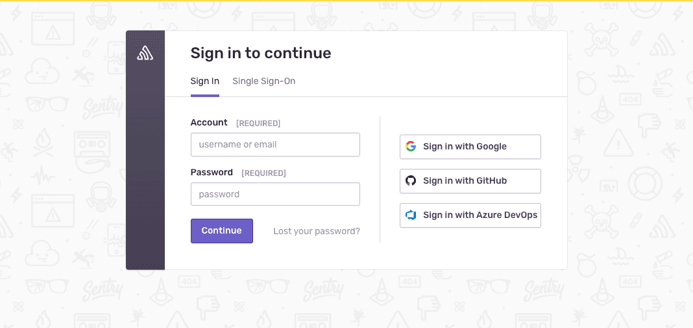
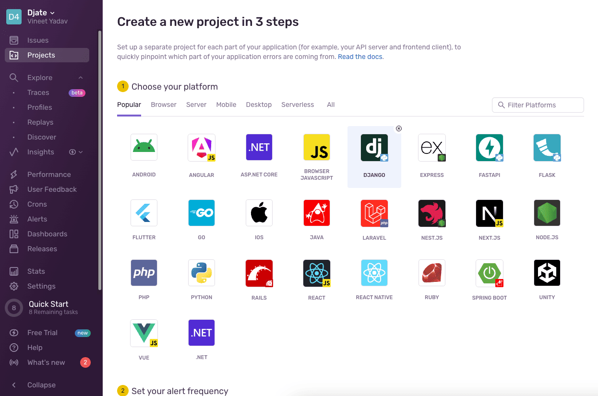
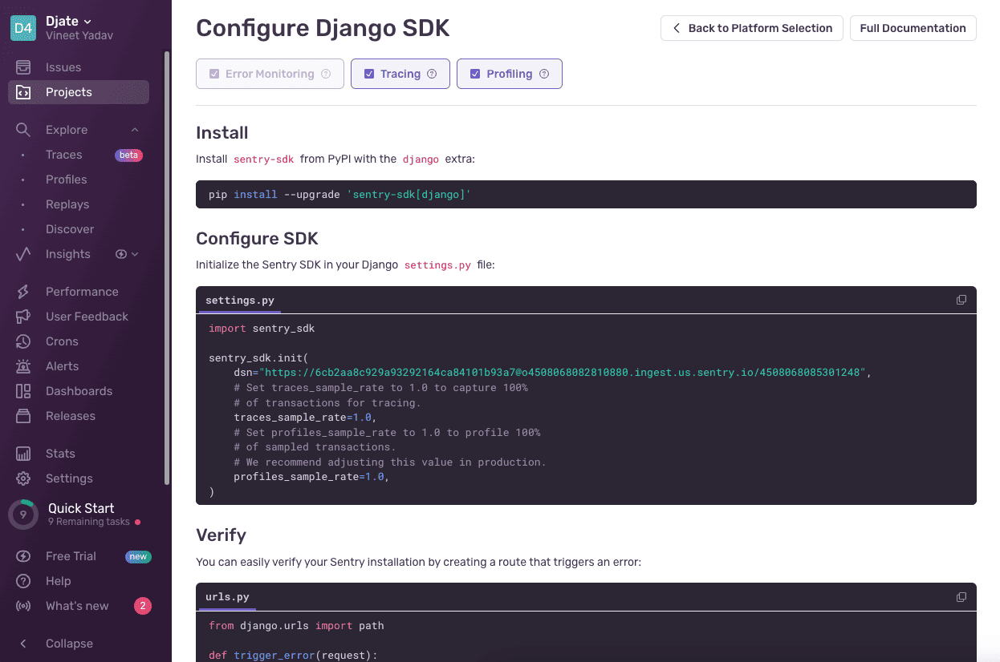

# Sentry Setup

* Login into [Sentry](https://sentry.io/auth/login/) or Create a [new account](https://sentry.io/signup/)

* Create a new project

* Copy the DSN and set it into the OS environment variable `SENTRY_DSN`

